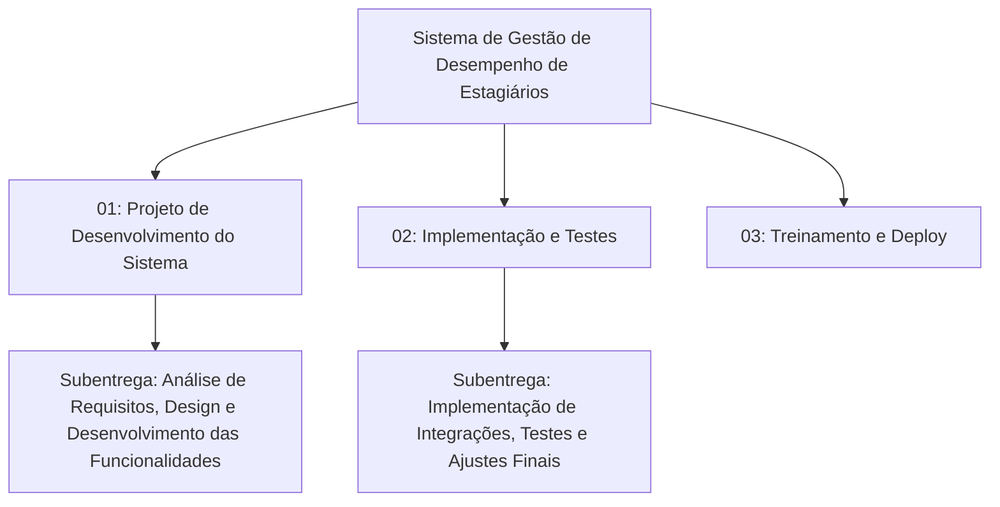

# Estrutura Analítica do Projeto

## 1º NÍVEL (Macroentregas do Projeto)
**Nome do Projeto:** Sistema de Gestão de Desempenho de Estagiários

- **Entrega 01:** Projeto de Desenvolvimento do Sistema  
  - *Exemplo:* Desenvolvimento do Sistema de Gestão de Desempenho de Estagiários
- **Entrega 02:** Implementação e Testes  
  - *Exemplo:* Testes e Validação das Funcionalidades
- **Entrega 03:** Treinamento e Deploy  
  - *Exemplo:* Treinamento dos Coordenadores e Publicação do Sistema

---

## 2º NÍVEL (Fases das Entregas)

### **Entrega 01: Projeto de Desenvolvimento do Sistema**
- **Subentrega 1.1:** Análise de Requisitos e Escopo  
  - *Exemplo:* Levantamento de Requisitos Funcionais e Não Funcionais
- **Subentrega 1.2:** Design e Arquitetura do Sistema  
  - *Exemplo:* Estruturação do Design e Definição de Tecnologia
- **Subentrega 1.3:** Desenvolvimento das Funcionalidades Principais  
  - *Exemplo:* Registro de Presença, Ferramenta de Avaliação, Dashboards Interativos

### **Entrega 02: Implementação e Testes**
- **Subentrega 2.1:** Implementação de Integrações e Feedbacks  
  - *Exemplo:* Integração de Feedbacks e Captura de Dados
- **Subentrega 2.2:** Testes de Funcionalidade e Usabilidade  
  - *Exemplo:* Testes com Coordenadores e Avaliação de Performance
- **Subentrega 2.3:** Ajustes Finais e Garantia de Qualidade  
  - *Exemplo:* Revisão das Funcionalidades e Compatibilidade com LGPD

### **Entrega 03: Treinamento e Deploy**
- **Subentrega 3.1:** Treinamento de Coordenadores e Usuários Finais  
  - *Exemplo:* Workshops e Manuais de Usuário
- **Subentrega 3.2:** Deploy e Manutenção Inicial  
  - *Exemplo:* Deploy na Intranet e Monitoramento Inicial do Sistema

---

## 3º NÍVEL (Atividades Específicas)

### **Subentrega 1.3: Desenvolvimento das Funcionalidades Principais**
- **Atividade 1.3.1:** Implementação de Registro de Presença
- **Atividade 1.3.2:** Desenvolvimento de Ferramenta de Avaliação Personalizável
- **Atividade 1.3.3:** Criação de Dashboards Interativos
- **Atividade 1.3.4:** Geração de Relatórios Personalizados

